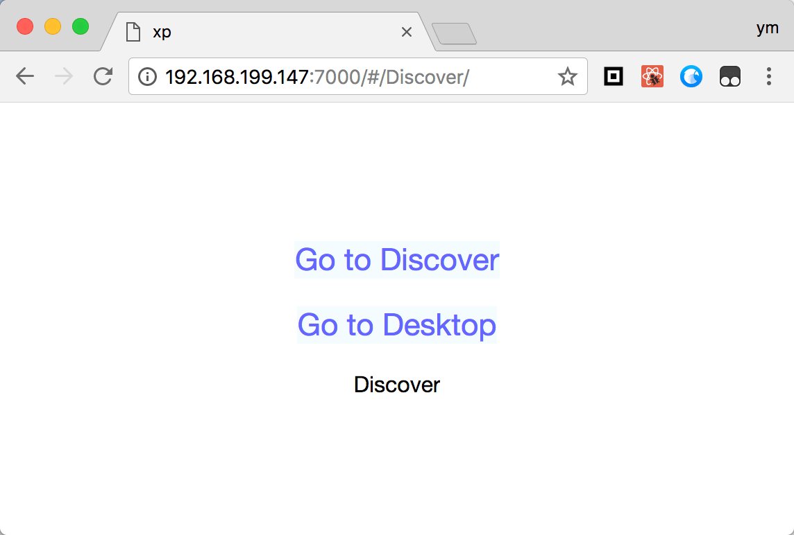

# React Router Hash History

> Use React-Router and History change Page, can use in React \ ReactNative \ ReactXP



## How to use

Create two componen
```
class Desktop extends React.Component{
  render(){
    return <View>
      <Text>Desktop</Text>
    </View>
  }
}
class Discover extends React.Component{
  render(){
    return <View>
      <Text>Discover</Text>
    </View>
  }
}
```

```
// in react or react-native App.js use the components
import {Router, Route, history, Switch,Redirect,hashChange} from 'react-router-hash-history'
class App extends RX.Component {
  componentDidMount(){
    // if begin use other URL page, to be use hashChange()
    hashChange()
  }
  render() {
    return (
      <Router history={history} >
        <View style={[ss.box]} >
          <Text onPress={()=>{
            // changeURL and Router
            history.push('/Discover/')
          }} style={[ss.text]} >Go to Discover</Text>
          <Text  onPress={()=>{
            // changeURL and Router
            history.push('/Desktop/')
          }} style={[ss.text]} >Go to Desktop</Text>
          <Switch >
          <Route exact path='/Discover/*' component={Discover} ></Route>
          <Route exact path='/Desktop/*' component={Desktop} ></Route>
          </Switch>
        </View>
      </Router>
    )
  }
}
```